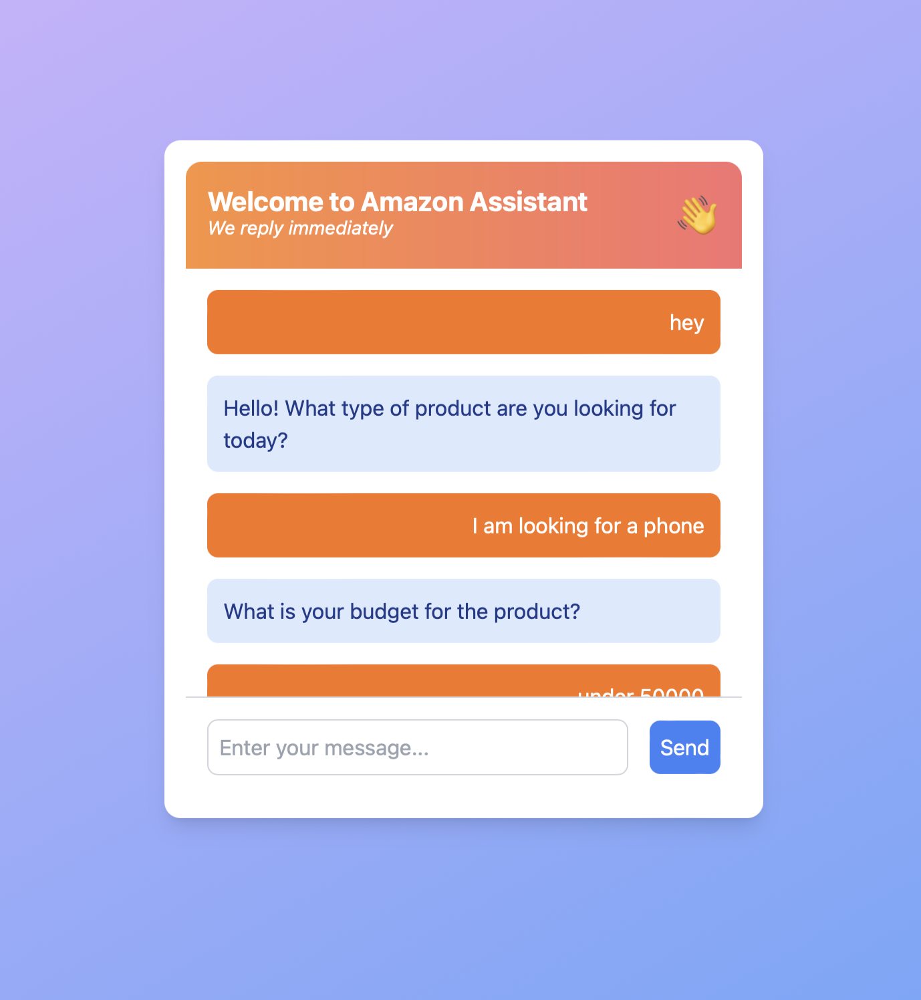

# AmazonBot - Intelligent Shopping Assistant

AmazonBot is an AI-powered chatbot designed to help users find the perfect product on Amazon based on their preferences and conversations with the bot. By leveraging advanced machine learning techniques, AmazonBot engages in natural language conversations to understand user intent and recommend products that best match their needs.

## Features

- **Conversational Shopping Experience:** Users can engage in a natural conversation with AmazonBot, discussing their preferences, needs, and any questions they might have about potential purchases.
- **Product Recommendations:** Based on the conversation, AmazonBot queries the Amazon API to fetch and recommend the most suitable products from Amazon's extensive catalog.
- **AI-Powered Conversations:** AmazonBot utilizes OpenAI's API for natural language processing, ensuring smooth and contextually aware interactions.
- **Machine Learning for Better Responses:** The bot's intent and response classification models are trained using machine learning algorithms, including Logistic Regression, to continuously improve the quality of responses and product recommendations.
- **Frameworks:** Built with Next.js for the frontend and Flask for the backend, ensuring a modern, scalable, and efficient architecture.

## How It Works

1. **User Interaction:** The user initiates a conversation with AmazonBot, discussing their product preferences, budget, and any other relevant details.
2. **Intent Recognition:** AmazonBot processes the conversation using trained machine learning models to understand the user's intent and extract key details.
3. **API Integration:** Based on the extracted information, AmazonBot queries the Amazon API to find products that best match the user's needs.
4. **Recommendation:** The bot presents the top product(s) to the user, along with additional details such as price, ratings, and a direct link to purchase.
5. **Learning:** Over time, the bot's responses improve as more conversations are processed, and the intent/response models are refined.

### Example Chatbot Workflow

Below is an example of the chatbot in action, showing how a conversation might unfold:

1. The user starts the conversation by greeting the bot.
2. AmazonBot asks the user what type of product they are looking for.
3. The user specifies the product category (e.g., phone).
4. AmazonBot asks the user for their budget.
5. The user provides their budget, and AmazonBot fetches the relevant product recommendations.

## Tech Stack

- **Frontend:** [Next.js]
- **Backend:** [Flask]
- **Natural Language Processing:** [OpenAI API]
- **Product Data:** [Amazon API]
- **Machine Learning:** Custom models trained using various machine learning algorithms, including Logistic Regression, for intent and response classification.

## Prerequisites

- **Node.js and npm** (for Next.js)
- **Python and pip** (for Flask)
- **API keys** for both OpenAI and Amazon APIs

## Future Work

- **UI Enhancements:** Work in progress on the user interface.
- **Advanced Training Algorithms:** Explore and implement more sophisticated machine learning algorithms for better conversation training and response accuracy.
